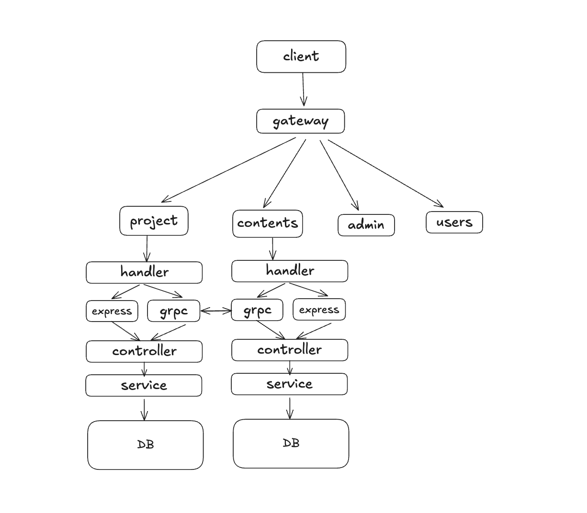

## Learnify

Learnify is a scalable, event-driven, microservices-based learning platform designed for modern, production-ready backend architectures. It uses **Node.js**, **TypeScript**, **gRPC**, **Redis**, **Kafka**, an **API Gateway**, **centralized logging**, and **GitHub Actions** for CI/CD.

---

## Features

### **Modular Microservices Architecture**
Each domain operates as an independent service, enabling isolated development, deployment, and scaling.

### **High-performance Communication with gRPC**
Services communicate through low-latency, type-safe protocol buffers designed for high throughput.

### **Event-Driven Architecture with Kafka**
System behavior is decoupled through asynchronous event streams that support reliable message delivery.

### **Caching Layer with Redis**
High-speed caching, rate-limiting, and session management improve overall system performance.

### **Centralized Logging**
Unified and structured logging captures HTTP and gRPC requests, errors, and service-level analytics.

### **CI/CD with GitHub Actions**
Automated pipelines handle testing, linting, building, and deployment across all services.

### **Scalable Project Layout**
The entire system is organized to allow independent service evolution and flexible scaling.

